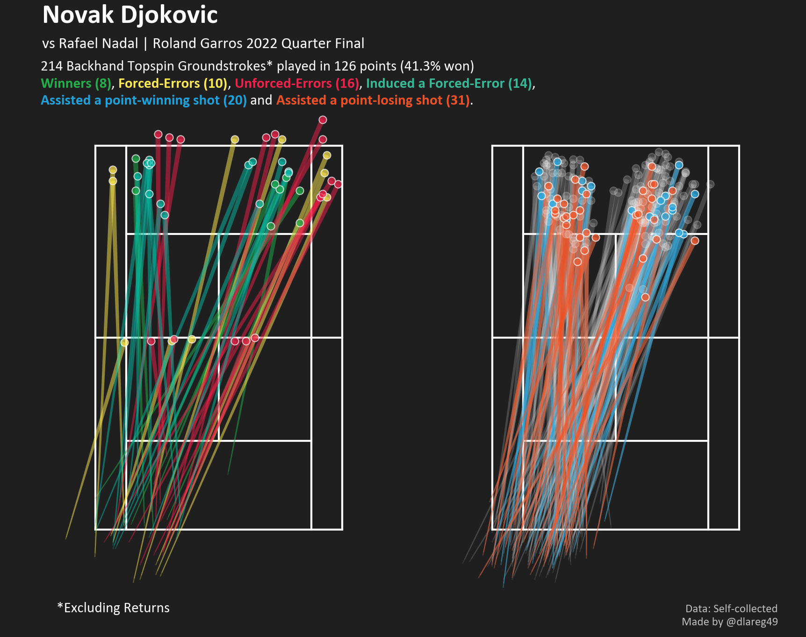

# Self-Collected Djokovic vs Nadal Roland Garros 2022 Event Data
Beta Release 30 July 2022

This repository contains my self-collected event data for the Roland Garros 2022 Quarter Final Match between
Novak Djokovic and Rafael Nadal. 

A writeup of this data collection experience, and a data visual-heavy report of the above match can be read on my blog here, containing figures like this!

## Data Information
All data is stored in the `events.csv` file, which includes the following columns:

1. Set: The current set number.
2. Player1_Sets/ Player2_Sets: The current number of sets won by each player (Player1 is Djokovic).
3. Game: The current game number within the current set.
4. Player1_Game/ Player2_Game: The current number of games won by each player in the current set.
5. Tiebreak: 1 indicates a Tiebreak is ongoing, 0 otherwise.
6. Player1_Score/Player2_Score: The current score (e.g. 0/15/30/40/A) of each player in the current point.
7. Point: The current overall point number in the match.
8. Stroke_Number: The current stroke/shot number in the point.
9. Point_Winner: Indicates the winner of a point-ending shot. '-' if shot is not point-ending. 
10. Player: The player hitting the current shot.
11. Serving: The player who served in the current point.
12. BP: 1 indicates that the current shot is played in either player's break point.
13. SP: 1 indicates that the current shot is played in either player's set point.
14. Shot_Side: Forehand (FH) or Backhand (BH).
15. Shot_Type: Indicates the type of shot played e.g. 1st Serve, Topspin, Slice. 
16. X: The x-coordinate (in meters) of the shot contact location (ball-racket), measured from the centre of the court (0,0). 
17. Y: The y-coordinate (in meters) of the shot contact location (ball-racket), measured from the centre of the court (0,0).
18. X2: The x-coordinate (in meters) of the shot bounce location (unless no-bounce is mentioned in the "Remarks" column), measured from the centre of the court (0,0).
19. Y2: The y-coordinate (in meters) of the shot bounce location (unless no-bounce is mentioned in the "Remarks" column), measured from the centre of the court (0,0).
20. Outcome: The shot outcome e.g. Winner, Forced-Error, Fault, In-Play. 
21. Remarks (Still WIP): Meant for contextual information e.g. noting if the shot did not bounce or if it was a passing shot. **This column is still not complete yet.**
22. Serve_Speed: The serve speed recorded (km/h) from the Infosys meter visible in the broadcast footage. Note: some serve speeds were not shown. 

Unfortunately, I did not manage to record the time or frame count in this project. 

---
## Court Orientation

The data has been scaled and shifted from its original coordinates into a 1:1 scale with (0,0) defined as the centre of the court. Not transformation has been applied to standardise the hitting/bounce/player sides yet i.e. plotting the data as it is should resemble the source broadcast view.  

---
## Notebook

A simple `notebook.ipynb` has been written to get you started on producing visuals from this data. 

---
## Errata

There are bound to be errors in the data due to the method of collection, my own judgement and carelessness (e.g. forgotting to change shot tags). Feel free to raise an issue if there are any shot(s) that you find, significantly deviated from reality.

My recording of the serve contact Y locations also wavered throughout due to me doubting where the ball tosses are and changing my mind a couple of times. I suggest you don't conduct any substantial analysis on the serve contact point locations. 

